# 基于C++的“书海”图书管理系统用户手册

**目录**

[一、 准备工作 ](#_Toc25707)

[二、 选择数据源 ](#_Toc17258)

[三、 学生用户端 ](#_Toc17575)

[（一） 登录界面 ](#_Toc18676)

[（二） 学生端主页 ](#_Toc15341)

[（三） 信息修改页 ](#_Toc23441)

[（四） 图书查询页 ](#_Toc27241)

[（五） 选择分类 ](#_Toc11848)

[（六） 图书详情页 ](#_Toc9317)

[（七） 借阅详情页 ](#_Toc1044)

[（八） 借阅历史页 ](#_Toc18785)

[（九） 借阅机制 ](#_Toc3361)

[（十） 欠款机制 ](#_Toc1244)

[（十一） 续借机制 ](#_Toc6886)

[（十二） 预约机制 ](#_Toc20099)

[（十三） 推荐机制 ](#_Toc18991)

[四、 管理员用户端 ](#_Toc27797)

[（一）登录界面 ](#_Toc31312)

[（二）管理员主页 ](#_Toc4808)

[（二） 账号管理界面 ](#_Toc25368)

[（三） 选择专业 ](#_Toc18672)

[（四） 添加学生 ](#_Toc26433)

[（五） 修改学生 ](#_Toc24625)

[（六） 图书管理界面 ](#_Toc28522)

[（七） 添加书籍 ](#_Toc12942)

[（八） 修改书籍 ](#_Toc14821)

[（九） 删除书籍 ](#_Toc2058)

[（十） 分类管理 ](#_Toc11733)

一.  **准备工作**

>   双击目录下的“Library.exe”即可运行。注意，本软件图片数据均从网络中获取，运行本软件应确保网络正常。

二.  **选择数据源**

>   运行软件，首先进入选择数据源界面，如图所示，本软件共有三个数据源，分别是：

-   初始数据：只有一个管理员账号，账号为：1234567，密码为：111111。

-   随机数据：系统随机生成的100000本书，10000名学生，40000条借阅记录。学生账号为：15020030001\~15020039999，密码为111111，一个管理员账号：1234567,密码：111111。

-   正常数据：图书信息从豆瓣读书爬取，学生信息从教务处爬取。学生账号海大16级，15级的正常学号都能登录，密码为：111111，一个管理员账号：1234567,密码：111111。使用此数据源需要联网。

-   由于正常数据加载网络图片不稳定，3.0版本已经去除。

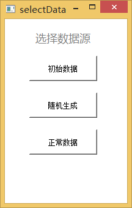

三.  **学生用户端**

1.  **登录界面**

>   使用正确的用户名密码，进行登录。无需选择是学生还是管理员，系统会根据账号的长度来自动判断是学生登录还是管理员登录，如图所示：

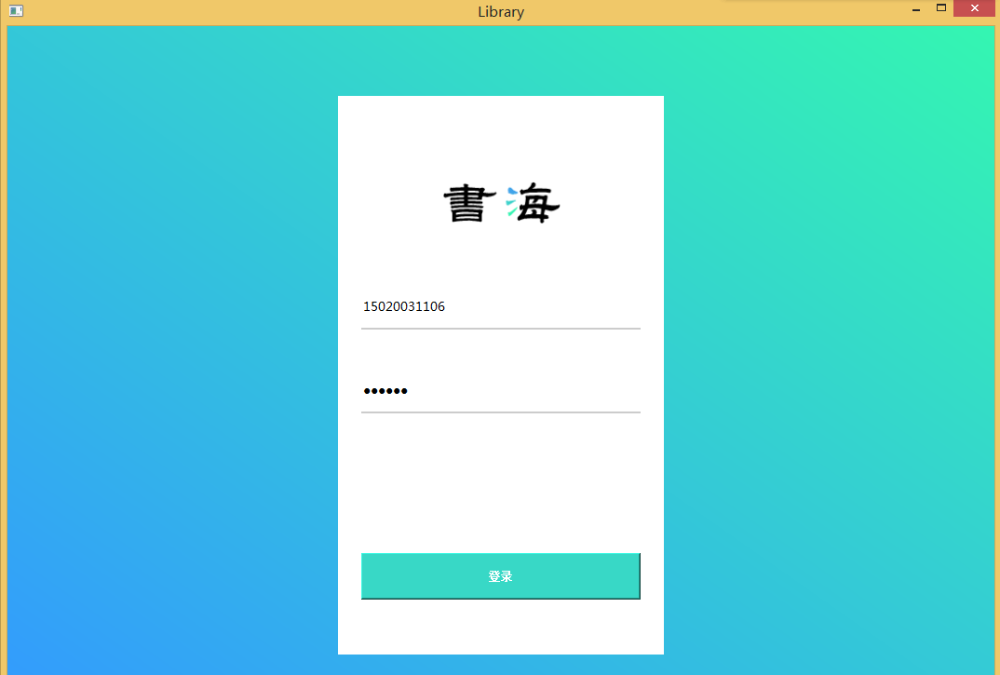

2.  **学生端主页**

>   登录后，进入主页，如图所示：右侧是导航栏，可以链接到其它页面；上方是用户基本信息，包括头像、学号、专业、欠款等；中部是当前借阅、预约、超期的书籍信息，借阅、超期的书籍可以查看详细信息，预约的书籍可以取消预约；下面是图书推荐页面，点击图书封面可以看到书籍的详细信息。

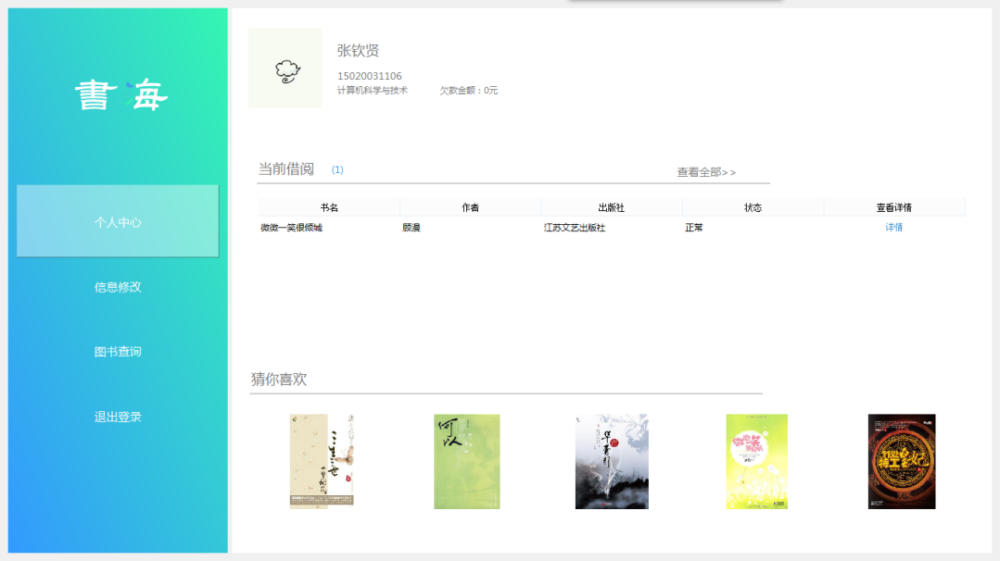

3.  **信息修改页**

>   点击“信息修改”按钮，进入信息修改页面，如图所示：此页面上方有三个按钮，分别是：“信息修改”，“密码修改”，“支付欠款”，功能分别是：

-   信息修改：此页可以查看并修改个人信息，能修改的只有邮箱和头像，姓名、专业、学号等不允许修改。

-   密码修改：此页可以修改个人密码，要求输入原密码和新密码。

-   支付欠款：此页在当前用户有欠款的情况下可以一键支付欠款。

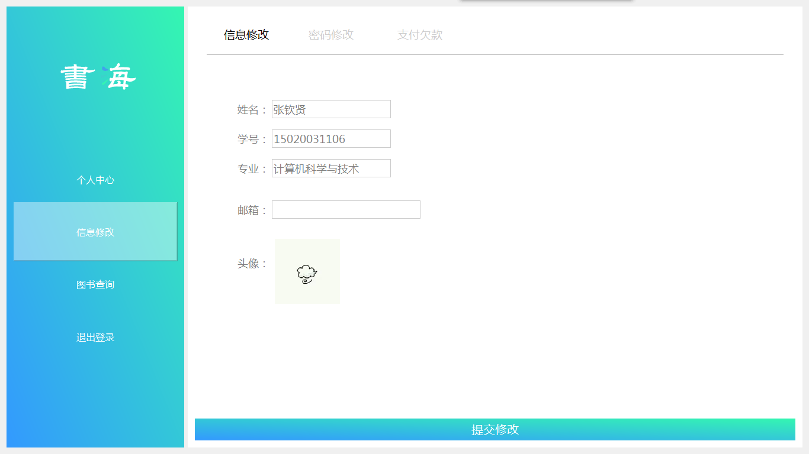

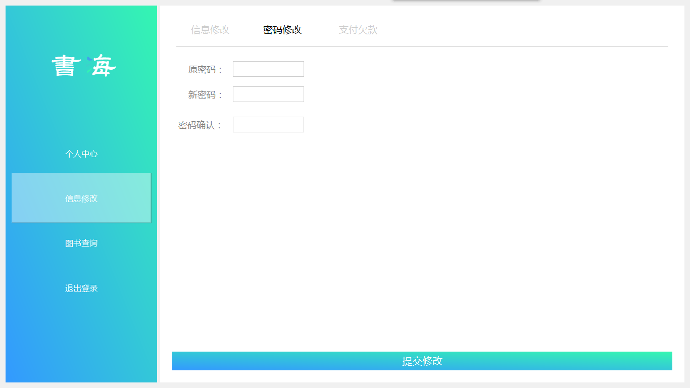

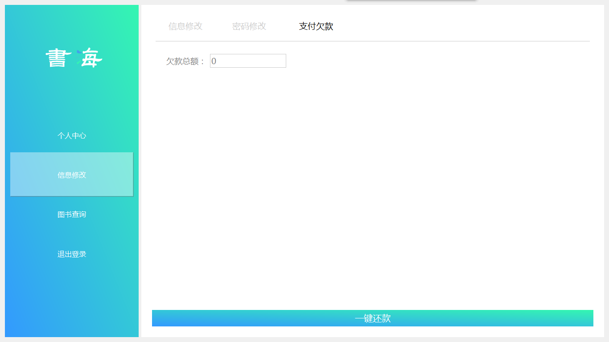

4.  **图书查询页**

>   点击“图书查询”按钮，进入图书查询页面，如图所示：此页面上方是一个文本框，用来输入书籍信息，右侧的放大镜按钮为搜索按钮，下方为四个查询条件，分别是：按书名查询、按作者查询、按ISBN查询、按分类查询。所有的查询均为模糊查询，当文库框中什么都不输时，默认为查询全部图书。

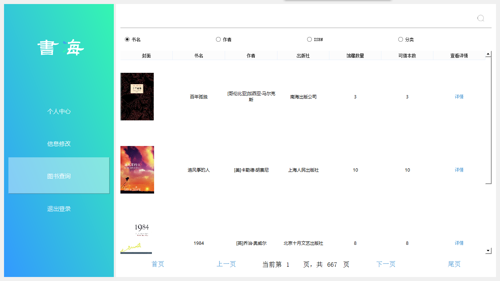

5.  **选择分类**

>   点击图书查询页中的“分类”按钮，可以查看所有的图书分类，选择特定的分类后会查询到该分类下的所有书籍，系统采用的分类方法为1本书只有1个分类，如果3.7、3.8所示：

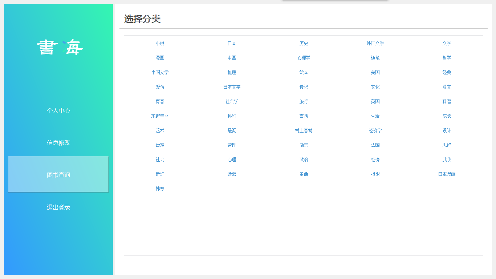

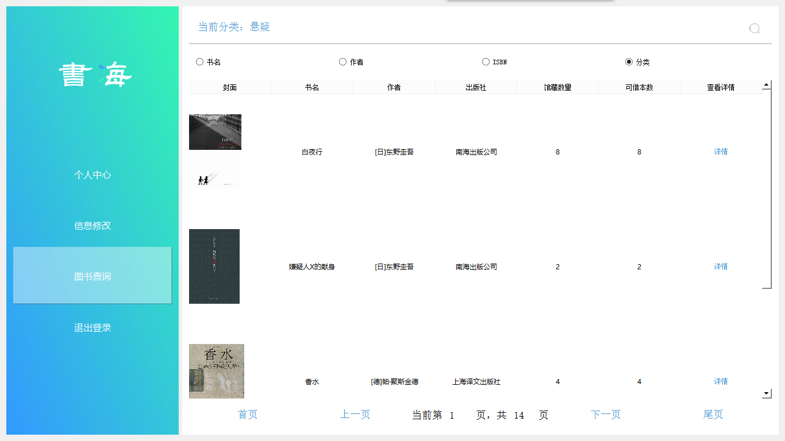

6.  **图书详情页**

>   在查询出的书籍中，点击“详情”按钮，可以看到书籍的详细信息。在此页可以进行借书，预约等操作，如果3.9所示：

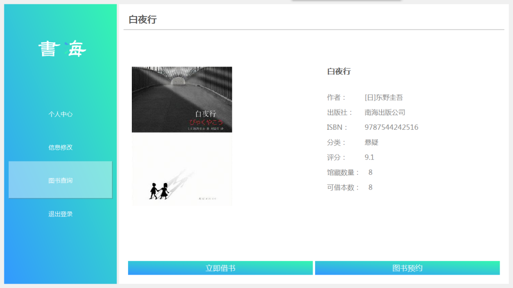

7.  **借阅详情页**

>   在主页的借书记录中点击“详情”按钮，可以看到当前借阅书籍的详细信息，在此页可以进行还书、续借等操作。

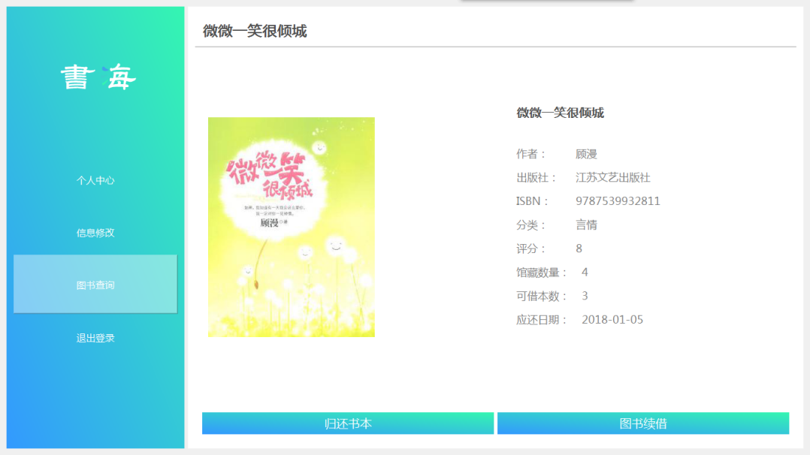

8.  **借阅历史页**

>   在主页的借书记录中点击“查看全部”按钮，可以看到当前登录用户的所有借书记录，包括已归还和未归还的。如图所示:

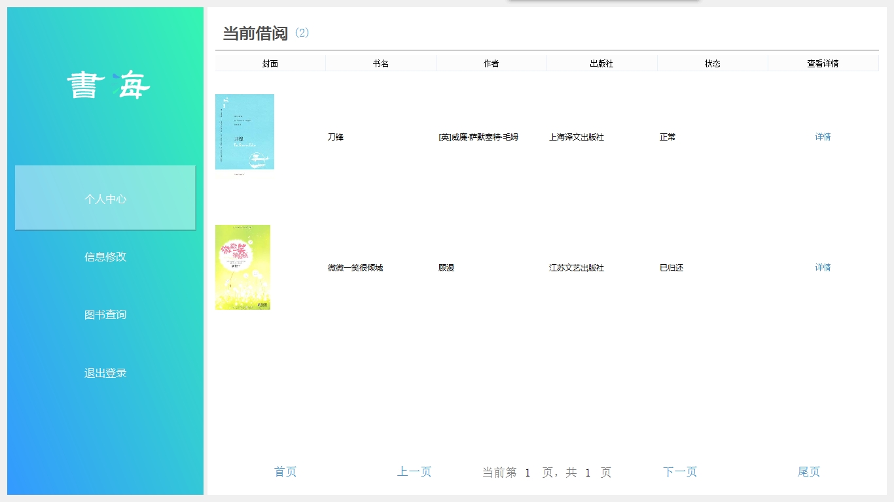

9.  **借阅机制**

>   每个学生用户最多只能借阅4本书籍，每本书籍的还书期限是1个月。

10.  **欠款机制**

>   当借阅图书超期时，便会产生欠款，计费模式为：1本书1天1块钱。当欠款金额大于50时，该用户便不能再借书了，必须在支付欠款页进行还款。

11.  **续借机制**

>   学生可以对当前借阅且未超期的图书进行续借，续借后，还书日期后延一个月，借阅的每本书只能续借一次，并且超期的图书不得续借。

12.  **预约机制**

>   当某本书的可借数量为0时，可以进行预约操作，可借数量不为0时，不可进行预约。一本书被预约后，比如有人预约了《高等数学》一书，当有一本《高等数学》被归还时，系统会查找所有预约这本书的记录，选择出预约时间最早的那个用户，并把这本归还的图书放到他的借阅记录中。一次预约的时间期限为5天，当发出预约申请后5天之内没有人还书，此预约申请作废。

13.  **推荐机制**

>   本软件的推荐算法非常简单，就是遍历登录用户的借阅记录，看看他所借的书籍中，哪个分类的书最多，然后在这个分类中随机挑选几本书推荐给他。当用户没有借书时，则执行随机推荐算法。

四.  **管理员用户端**

1.  **登录界面**

>   使用正确的用户名密码，进行登录。无需选择是学生还是管理员，系统会根据账号的长度来自动判断是学生登录还是管理员登录，如图所示：

2.  **管理员主页**

>   登录后进入管理员主页，在此页面可以进行管理员的邮箱信息修改，和密码修改，如图所示：

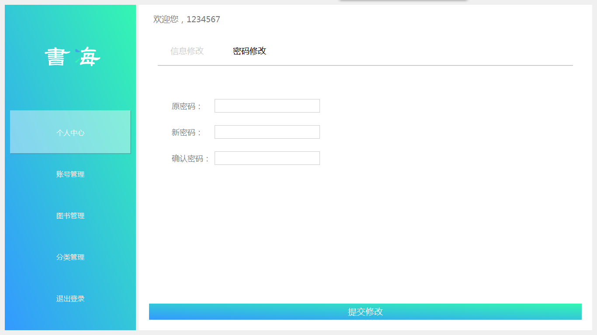

3.  **账号管理界面**

>   点击“账号管理”按钮，进入账号管理页面，如图所示：此页面上方是一个文本框，用来输入学生信息，右侧的放大镜按钮为搜索按钮，下方为三个查询条件，分别是：按姓名查询、按学号查询、按专业查询。所有的查询均为模糊查询，当文库框中什么都不输时，默认为查询全部学生。

>   此页可以对查询到的学生进行各种管理操作，包括：重置密码、清除欠款、删除、修改等，当学生尚有书在借，或者尚有书在预约时，不能删除该学生。

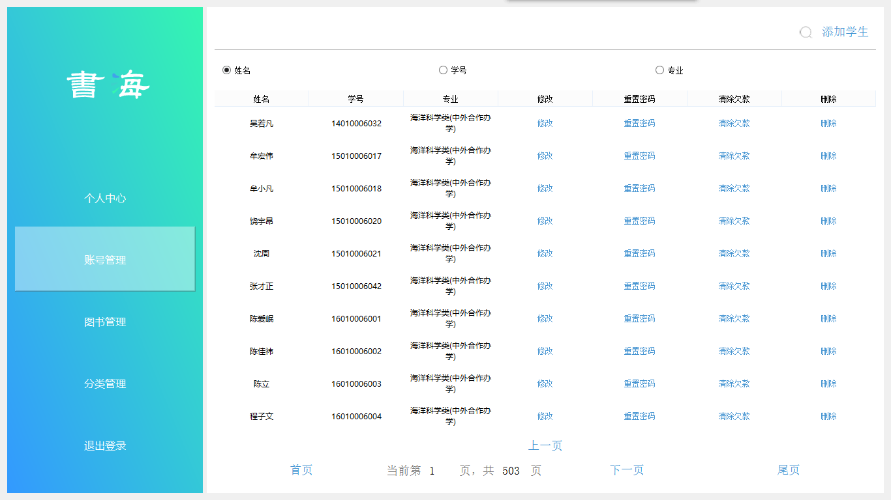

4.  **选择专业**

>   点击账号管理页中的“专业”按钮，可以查看所有学生的专业，选择特定的专业后会查询到属于该专业的所有学生，如图所示：

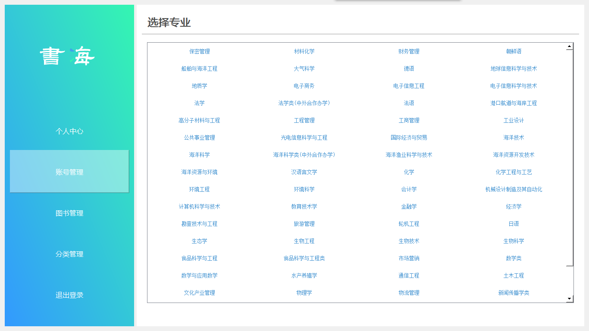

5.  **添加学生**

>   点击账号管理页中的“添加学生”按钮，可以进入添加学生的界面，添加学生要求输入学生的学号、专业、性别等信息，学号不可重复，如图所示：

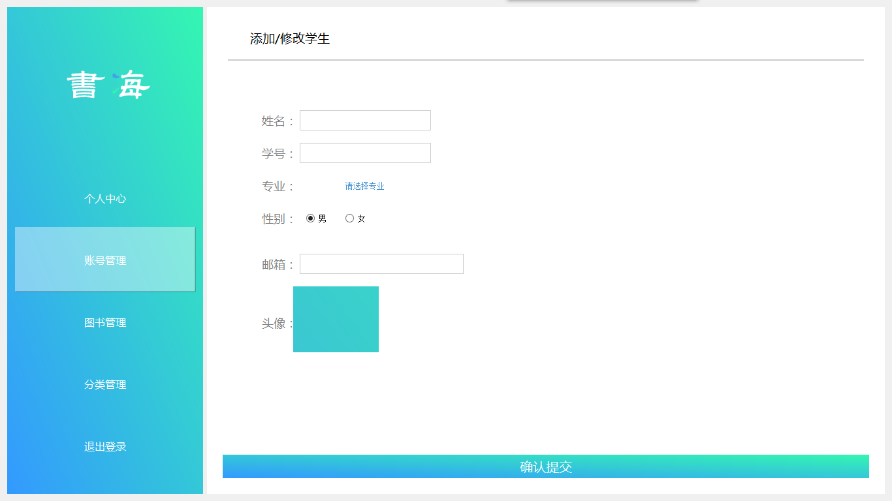

6.  **修改学生**

>   在查询出的学生中，点击“修改”按钮，可以进入修改学生信息的界面，可以修改学生的专业、性别等信息。如图所示：

7.  **图书管理界面**

>   点击“图书管理”按钮，进入图书管理页面，如图所示：此页面上方是一个文本框，用来输入书籍信息，右侧的放大镜按钮为搜索按钮，下方为四个查询条件，分别是：按书名查询、按作者查询、按ISBN查询、按分类查询。所有的查询均为模糊查询，当文库框中什么都不输时，默认为查询全部书籍。

>   此页可以对查询到的书籍进行各种管理操作，包括：增加库存、修改、删除等。

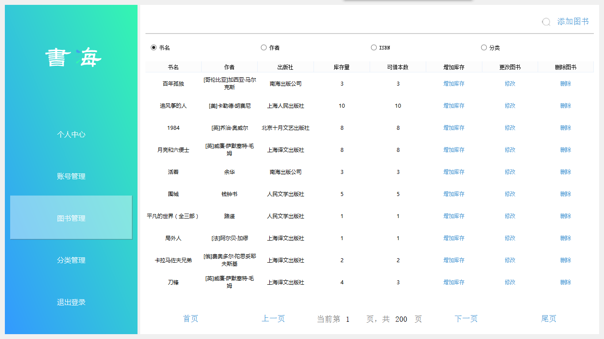

8.  **添加书籍**

>   点击图书管理页中的“添加图书”按钮，可以进入添加图书的界面，添加图书要求输入图书的数名、作者、ISBN、分类等信息，ISBN不可重复，如图所示：

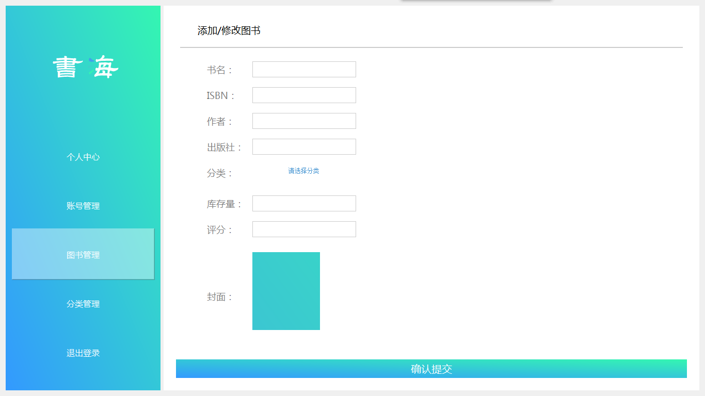

9.  **修改书籍**

>   在查询出的书籍中，点击“修改”按钮，可以进入修改图书信息的界面，可以修改图书的书名、作者、分类等信息。如图所示：

10.  **删除书籍**

>   在查询出的书籍中，点击“删除”按钮，可以进入删除图书信息的界面，此界面展示了此类书的所有副本的借阅情况，其中，被借出的书和被预约的书籍不可删除，如图所示：

11  **分类管理**

>   点击“分类管理”按钮，可以进入分类管理界面，此界面可以查询分类，添加分类，修改分类和删除分类，如图所示：

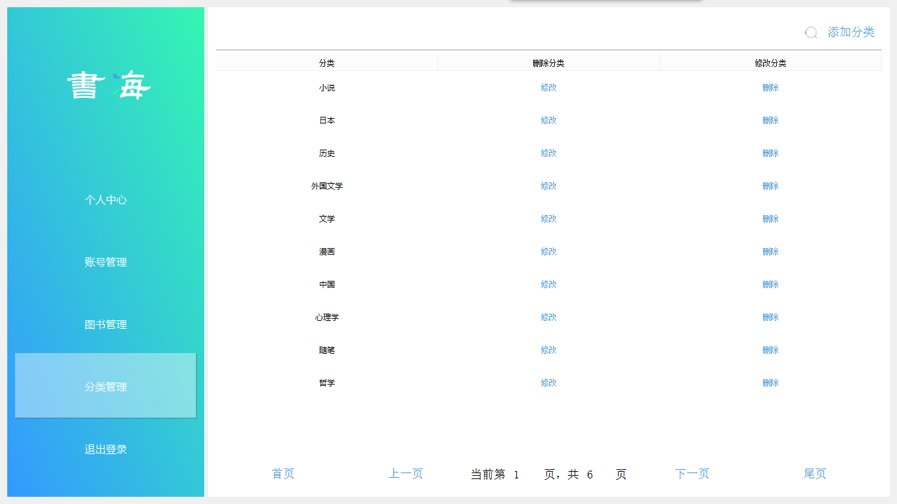
